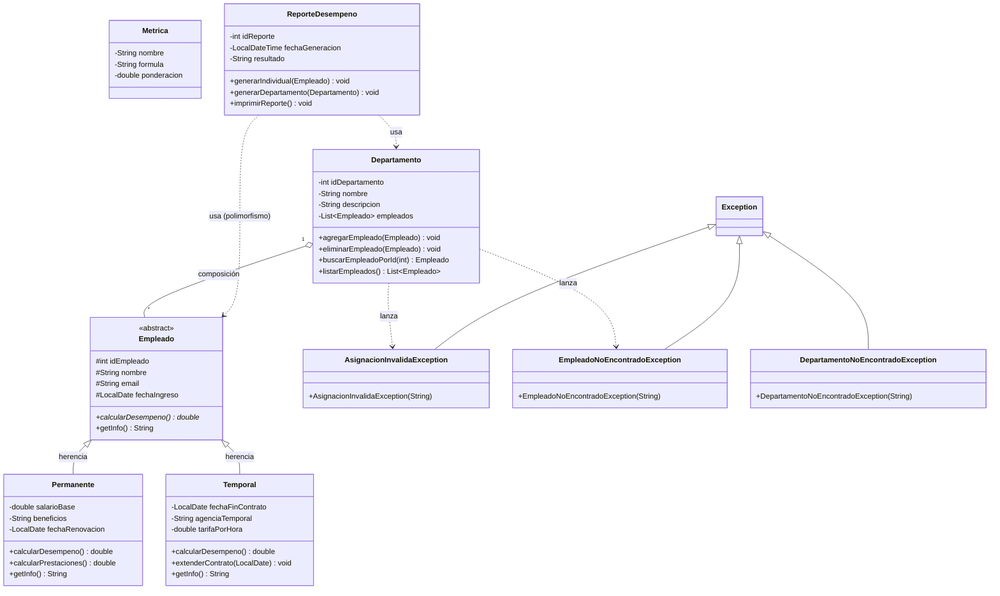
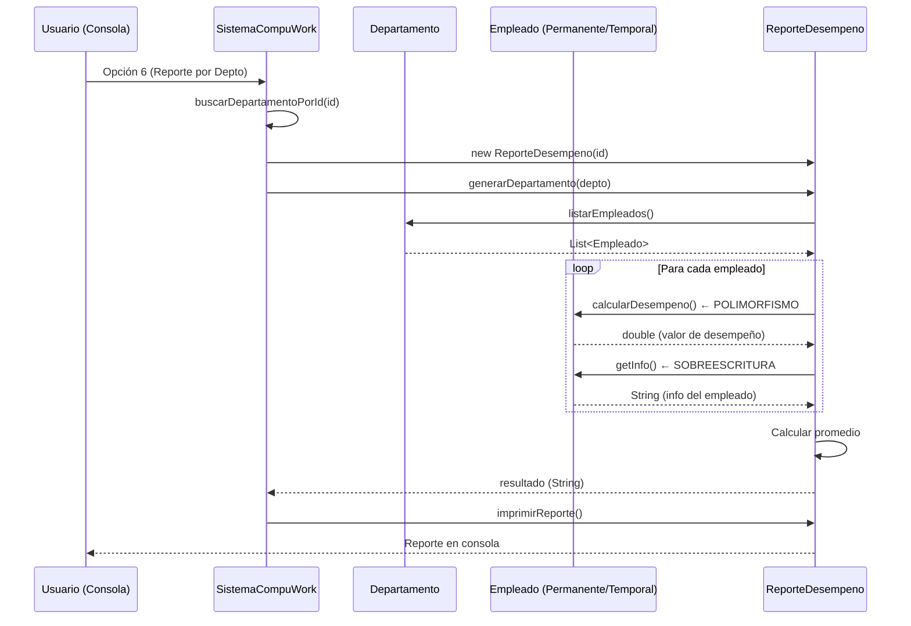
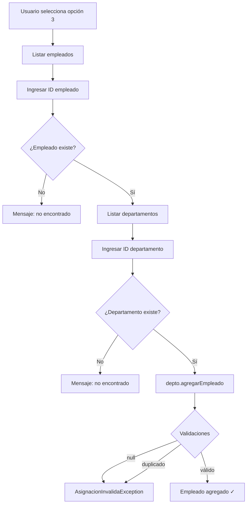

<h2>Sistema de gestión CompuWork</h2>

Requisitos previos:
- Apache Netbeans IDE 22
- Java 8
- JDK 17

Requisitos para hacer pruebas unitarias:
- JUnit 4.13.2
- Hamcrest 1.3

Instrucciones para compilar el programa:
Abrir el IDE Netbeans, y dar click en File > Open Project (Ctrl+Shift+O)
Luego click en Run > Build Project
Y se obtiene el archivo .jar en la carpeta dist dentro del código

Instrucciones para ejecutar el programa:
Asegurese de obtener Java 8 antes de iniciar el proceso, luego ir al CMD para escribir el siguiente comando:
java -jar "ubicacion del archivo sin las comillas"\SistemaCompuWork.jar

Instruccion para ejecutar las pruebas:

Antes de comenzar las pruebas unitarias, asegurese de obtener el JUnit 4.13.2 y el Hamcrest 1.3 para que las pruebas funcionen
correctamente.
En Netbeans con el proyecto abierto se da click en Run > Test Project para ejecutar todos los archivos de prueba
o hacer click en un archivo de prueba Run > Test File

<h2>Diagrama de clases</h2>

<h2>Diagramas de flujo</h2>

Ciclo de vida del reporte de desempeño

Asignación de un empleado a un departamento

